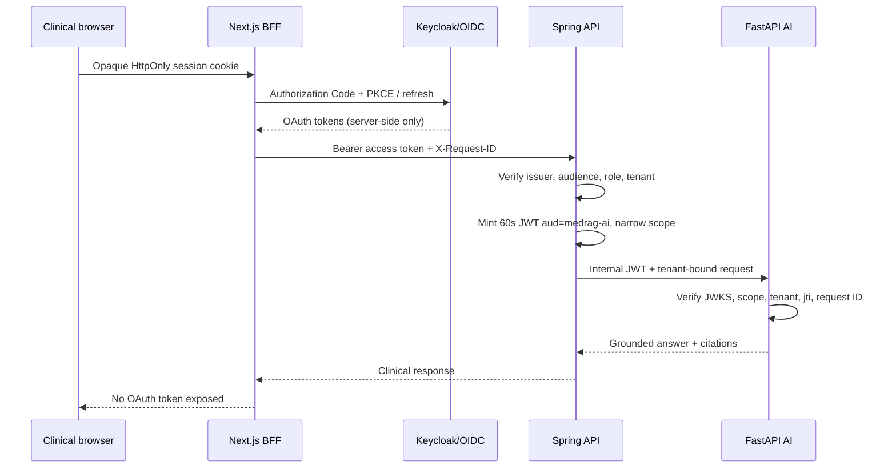

# Architecture

## Trust boundaries

1. **Browser boundary** — the browser receives only an opaque, HttpOnly, SameSite=Lax session identifier. OAuth access and refresh tokens are encrypted with AES-256-GCM and stored in server-side Redis; only Next.js route handlers can consume them.
2. **Public API boundary** — Spring Boot is the sole public clinical API. It validates Keycloak JWTs, checks audience, maps roles, requires a non-empty `tenant_id` claim, and applies Redis-backed per-actor/tenant rate limits after authentication.
3. **AI boundary** — FastAPI is not exposed to untrusted callers in production. Spring mints an internal RS256 JWT valid for 60 seconds, with `aud=medrag-ai`, one narrow scope, tenant, actor, and request ID.
4. **Data boundary** — source documents and FAISS indexes use private S3 buckets. Source documents use configurable S3/KMS encryption in production; local MinIO intentionally does not pretend to provide KMS. Chunk text and serialized FAISS indexes are additionally encrypted using AES-256-GCM at the application layer.

## Why external identity management

MedRAG does not implement passwords or refresh-token rotation inside application code. Keycloak is the local reference IdP; production deployments can use any standards-compliant OIDC provider. This keeps authentication lifecycle, MFA, account recovery, federation, session revocation, and policy configuration outside the clinical domain service.

## Why the original user token is not forwarded

Forwarding the Keycloak token to Python would:

- increase the number of services trusted with the full user credential;
- couple Python to external IdP claim shape and authorization policy;
- make least-privilege audience restriction harder;
- leak unrelated claims into inference infrastructure.

Instead, Spring performs token exchange at the application boundary. The AI token is deliberately non-refreshable and very short lived.

## Multi-tenancy

The tenant ID comes exclusively from a verified token claim. The API never accepts a caller-selected tenant ID for authorization. All database lookups include tenant ID. AI routes compare the token tenant against the request tenant and reject mismatches. Object keys are namespaced by tenant and document UUID.

For regulated production, add PostgreSQL Row Level Security as a second line of defense and use a transaction-scoped tenant setting. The application-level checks in this repository remain required even with RLS.

## Ingestion reliability

Uploads and ingestion jobs are committed in one PostgreSQL transaction, with best-effort object cleanup on rollback. A scheduled dispatcher locks due jobs with `FOR UPDATE SKIP LOCKED`, runs them through a bounded worker pool, heartbeats recoverable leases, fences stale completions by worker ownership, prioritizes purges, and retries only transient failures with bounded exponential backoff. AI-side deletion tombstones prevent an in-flight ingestion from recreating purged chunks.

## Retrieval

Each tenant has an `IndexIDMap2(IndexFlatIP)` FAISS index. Embeddings are normalized, making inner product cosine-equivalent. The serialized index is encrypted before object storage. A Redis lock protects index mutation. Chunk IDs are durable PostgreSQL bigint IDs used as FAISS IDs.

## LLM boundary

No public LLM provider is configured by default. When `LLM_BASE_URL` and `LLM_MODEL` are set, the AI service calls an OpenAI-compatible endpoint. Production startup rejects public-looking hosts unless they are explicitly allowlisted or resolve to an approved private address pattern. Context is treated as untrusted data, citations are required, and the model is instructed not to follow instructions embedded in medical documents.

## Browser security

Next.js is a BFF rather than a token-bearing SPA. OAuth tokens remain in encrypted Redis sessions. Mutating BFF and logout routes enforce same-origin requests, and page responses use a fresh CSP nonce so Next.js runtime scripts can execute without enabling unrestricted inline scripts.

## Operational and SaaS foundations

The overview API computes tenant-scoped document and durable-job counts rather than serving static dashboard data. Dead jobs remain visible until a Clinic Admin explicitly redrives them. The operator page performs read-only server-side checks against the BFF, Spring readiness endpoint, AI service, identity provider, object storage, and Redis; only status/latency and a support code reach the browser.

Tenant settings are policy metadata. Retention is opt-in, legal hold blocks deletion and automated expiry, and privacy requests store only a normalized reference hash. Usage metering is append-only and intentionally stops before billing-provider coupling.

Per-tenant private-LLM configuration stores `vault://path#field` references only. Spring sends those non-secret references and the approved model identifier through the internal service request; FastAPI resolves endpoint and API-key values directly from Vault at query time using a mounted workload token. The browser and Spring database never receive the credential value. Dynamic endpoints are still subject to the private-host/allowlist SSRF policy, and failed Vault resolution degrades visibly to evidence-only extractive output rather than bypassing the trust boundary.

## Key diagrams

See `docs/adr/0001-do-not-forward-user-tokens-to-ai.md` for the decision record.
